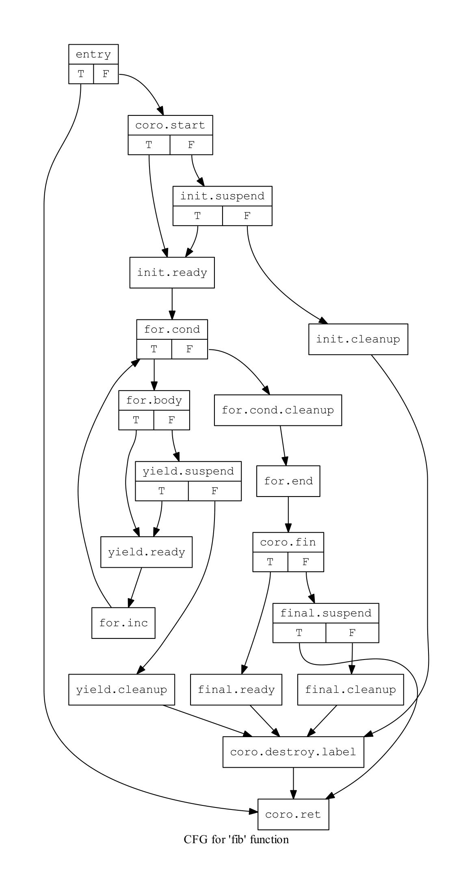
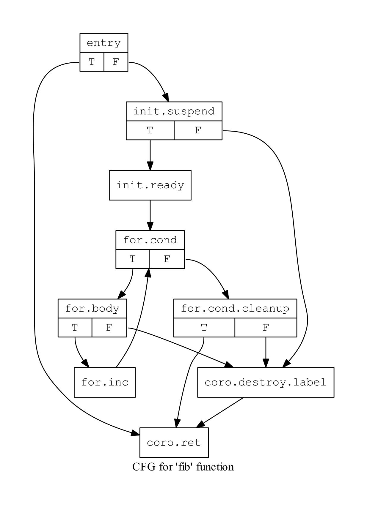
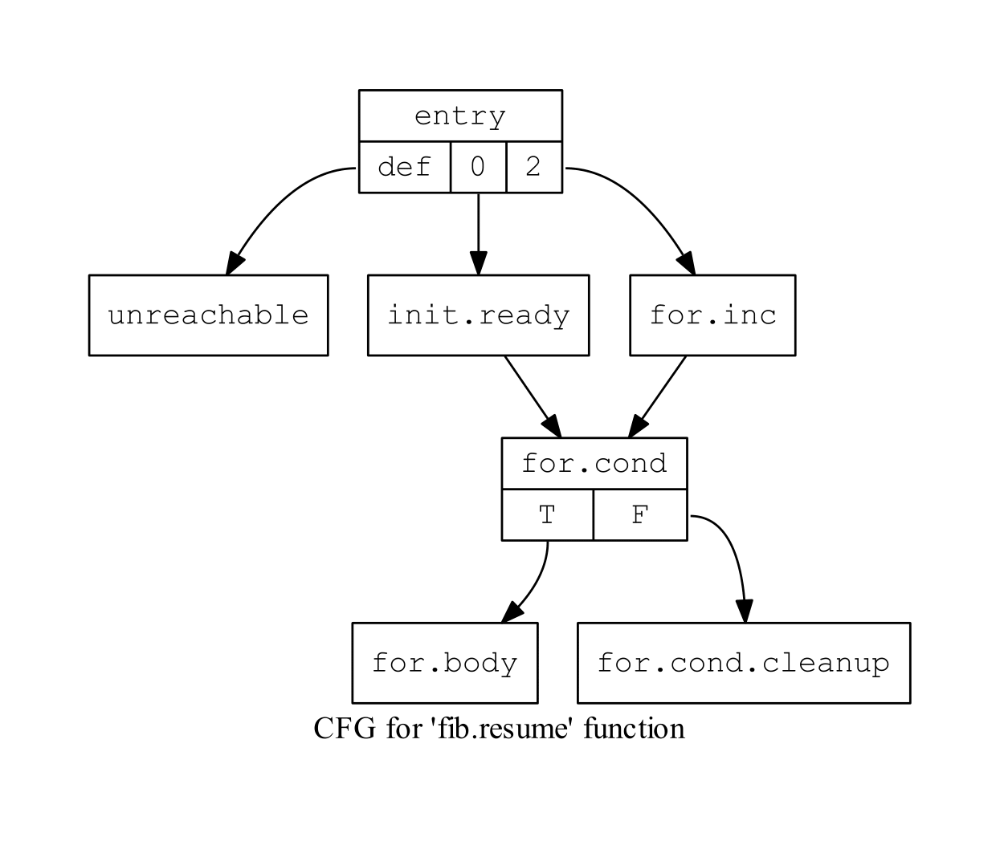

====================================
Coroutines passes (work in progress)
====================================

This document sketches out current thinking how 
coroutines are implemented in llvm. Short term goal
is to support C++ coroutines per WG21/P0057. 
Reperesentation is not C++ specific and can be
targeted by other languages.

Coroutine related llvm intrinsics
=================================
:declare i32 @llvm.coro.size():
  This intrinsic returns the size of the coroutine frame.

:declare i8* @llvm.coro.init(i8*):
  This intrinsic receives a pointer to dynamically allocated
  memory for the coroutine frame. 

.. code-block:: llvm

  %0 = call i32 @llvm.coro.size()
  %1 = call noalias i8* @malloc(i32 %0)
  %2 = call i8* @llvm.coro.init(i8* %1)

:declare i1 @llvm.coro.suspend(i8*, i8*):
  This intrinsic marks a suspension point in a coroutine. 
  First parameter is a pointer to be passed to a suspend ramp function.
  Second parameter is an address of suspend ramp function.
  Return value: True if suspend is needed, false otherwise.

.. code-block:: llvm

  %0 = bitcast %"struct.std::suspend_always"* %ref.tmp to i8*
  %1 = call i1 @llvm.coro.suspend(i8* %3, bitcast @"_RampFn" to i8*))

:declare void @llvm.coro.param(i8*, i8*):

  This intrinsic establishes a relationship between a parameter
  of a coroutine and parameter copy. If parameter is used
  after a resume point, all of the its uses a replaced with a reference
  to a copy of a parameter, otherwise, all of the code used to produce
  a copy of a parameter can be elided.

:declare void @llvm.coro.resume(i8*):
  Given a coroutine frame pointer, this intrinsic resumes the coroutine.

:declare void @llvm.coro.destroy(i8*):
  Given a coroutine frame pointer, this intrinsic destroys the coroutine.

:declare i1 @llvm.coro.done(i8*):
  Given a coroutine frame pointer, this intrinsic tells if the coroutine
  is suspended at a final suspend point.

Walkthrough
===========

Let's explore what happens to ``coroutine-basic.cpp`` test from 
``llvm/tools/clang/test/CodeGenCXX``. Compile with -fcoroutines -fno-exceptions 

.. code-block:: c++

  #include "inputs/coroutine.h"

  struct minig {
    [ implementation snipped ]
    bool move_next();
    int current_value();
  };

  minig fib() {
    for (int i = 0; i < 5; i++)
      co_yield i;
  }

  int main() {
    int sum = 0;
    auto g = fib();
    while (g.move_next())
      sum += g.current_value();
    return sum - 10;
  }

Front-End Semantic Transformation
=================================

.. code-block:: c++

  minig fib() {

    // allocate the memory for the coroutine frame
    void* mem = ::operator new(llvm.coro.size());
    llvm.coro.init(mem);

    // grab the desired return object from the promise
    promise_type __promise;
    minig result = __promise.get_return_object();

    await __promise.initial_suspend();

    for (int i = 0; i < 5; i++) {
      await __promise.yield_value(i);
    }
    auto __promise.final_suspend();

    ::operator delete(llvm.coro.frame());
    return __result;
  }

Await Expansion
===============

``await expr`` becomes:

.. code-block::

    %temp = expr
    %ready = call %temp.await_ready()
    br %ready, label.ready, label.suspend
  
  label.suspend:
    %nope = call @llvm.coro.suspend(&temp, &rampFun)
    br %nope, label.ready, label.cleanup

  label.cleanup:
    ; destructors to be run if we destroy coroutine
    ; while it is suspended at this suspend point
    br coro.cleanup; // label where we cleanup promise 

  label.ready:
    %result = call %temp.await_resume()
    ... whatever follows await expr

Where rampFun is properly specialize function template
with Promise being a type of the promise of the enclosing
coroutine and Awaitable is a type of a temporary on which
``await_suspend`` needs to be called.

.. code-block:: c++

  // FIXME: generate in the FE
  template <typename Awaitable, typename Promise> 
  void _Ramp(void *a, void *b) {
    static_cast<Awaitable *>(a)->await_suspend(
      std::coroutine_handle<Promise>::from_address(b));
  }                                                                                        

Final Await Expansion
=====================

Coroutine cannot be resumed if it is suspended at the final
suspend point. The only legal operation on the coroutine is
``@llvm.coro.destroy`` or ``@llvm.coro.done``.

One way to represent that would be to place unreachable at the
resume edge, but, that would not survive simlify-cfg pass.
Thus, we do an artificial resume edge pointing at the return block.
coro-split path uses this property to discover where final suspend
point is.

Artifical @llvm.coro.done node
==============================
Entry block is terminated with an artificial branch that marks 
the start of the coroutine and the return block.

.. code-block:: llvm

  %5 = call i1 @llvm.coro.done(i8* null)
  br i1 %5, label %coro.ret, label %coro.start

coro-split path finds this, figures out where the start and 
return block of the coroutine is observing these branches and
gets rid of it.

Putting it all together. CFG for coroutine coming out of FE
===========================================================
For the following coroutine 

.. code-block:: c++

  minig fib() {
    for (int i = 0; i < 5; i++)
      co_yield i;
  }

We will end up with the following graph

(see 01AfterFE.ll for details)

Simplifying it a little
=======================

At EP_EarlyAsPossible extension point we run
"coro-eary" pass to change coroutine attributes to optnone noinline,
so that mem2reg and sroa won't mess up allocas in the body of the coroutine
until the split.

At the EP_ModuleOptimizerEarly we run "coro-pre-split" path that inlines
trivial empty functions (like a lot of await_suspend/await_resumes are)
and replaces await_ready's with constants where applicable. With subsequent
cleanup by simplifycfg and earlycse passes.

At this point we end up with much simpler CFG, still retaining all 
of the structural information required to do the split.

Coroutine split
===============

This pass creates a coroutine frame structure 

.. code-block:: llvm

  %fib.frame = type { 
     void (%fib.frame*)*,             ; resumeFnPtr
     void (%fib.frame*)*,             ; destroyFnPtr
     i32,                             ; suspend index
     %"struct.minig::promise_type",   ; promise
     i32                              ; variable i
  }

and splits up the coroutine into four parts.
fib.resume, fib.cleanup, fib.destroy with leftovers staying in fib:

.. code-block:: llvm

  ; allocates coroutine frame
  ; prepare return value
  ; initialize resumeFn, destroyFn and suspendIndex fields
  define void @fib(%struct.minig* noalias sret %agg.result) {
  entry:
    ...
    %2 = zext i32 32 to i64
    %call = call noalias i8* @_Znwm(i64 %2) ; ::operator new
    %3 = call i8* @llvm.coro.init(i8* %call)
    %frame = bitcast i8* %3 to %fib.frame*
    %4 = getelementptr %fib.frame, %fib.frame* %frame, i32 0, i32 0
    store void (%fib.frame*)* @fib.resume, void (%fib.frame*)** %4
    %5 = getelementptr %fib.frame, %fib.frame* %frame, i32 0, i32 1
    store void (%fib.frame*)* @fib.destroy, void (%fib.frame*)** %5
    
    %7 = getelementptr %fib.frame, %fib.frame* %frame, i32 0, i32 2
    store i32 0, i32* %7
    br label %coro.ret

  coro.ret:                                         ; preds = %init.suspend
    call void @_ZN5minigC1EOS_(%struct.minig* %agg.result, %struct.minig* %__return)
    call void @_ZN5minigD1Ev(%struct.minig* %__return)
    ret void
  }

``fib.resume`` is invoked when coroutine is resumed 
via @llvm.coro.resume intrinsic.

.. code-block:: llvm

  define internal fastcc void @fib.resume(%fib.frame* %frame.ptr) {
  entry:
    %0 = getelementptr %fib.frame, %fib.frame* %frame.ptr, i32 0, i32 2
    %resume.index = load i32, i32* %0
    switch i32 %resume.index, label %unreachable [
      i32 0, label %resume.point.0
      i32 2, label %resume.point.2
    ]
    ...  
  }

``fib.destroy`` is invoked when coroutine is resumed 
via @llvm.coro.destroy intrinsic.

.. code-block:: llvm

  define internal fastcc void @fib.destroy(%fib.frame* %frame.ptr) {
  entry:
    %frame.void.ptr = bitcast %fib.frame* %frame.ptr to i8*
    call fastcc void @fib.cleanup(%fib.frame* %frame.ptr)
    br label %coro.destroy.label

  coro.destroy.label:                               ; preds = %entry
    call void @_ZdlPv(i8* %frame.void.ptr)          ; ::operator delete
    ret void
  }

``fib.cleanup``, ie. running all of the destructors is split 
away from memory deallocaiton to enable heal allocation elision 
optimization. If we decided to place coroutine frame on the 
callers frame, we only invoke cleanup when coroutine is destroyed.

.. code-block:: llvm

  ; fib example has no cleanup, so fib.cleanup will be empty
  ; but in general case, it would have a similar structure to resume
  ; with case labels representing destructors calls required to
  ; clean up the coroutine state from a particular suspend point

  define internal fastcc void @fib.cleanup(%fib.frame* %frame.ptr) {
  entry:
    %0 = getelementptr %fib.frame, %fib.frame* %frame.ptr, i32 0, i32 2
    %resume.index = load i32, i32* %0
    switch i32 %resume.index, label %unreachable [
      i32 0, label %cleanup.point.0
      i32 2, label %cleanup.point.2
    ]
    ...  
  }

See 03AfterSplit.ll for full llvm listing.
Here is a CFG for fib.resume:

Heap Elision
============

Now, let's look at the call sites when coroutine is invoked.
The ``coro-elide`` pass runs after inlinig to look for opportunities 
to elide heap allocations. 

.. code-block:: llvm

  ; See 04BeforeElide.ll for full llvm listing.
  define i32 @main() {
  entry:
    %call.i = tail call noalias i8* @_Znwm(i64 32), !noalias !1
    %1 = tail call i8* @llvm.coro.init(i8* %call.i), !noalias !1
    %2 = bitcast i8* %1 to void (%fib.frame*)**
    store void (%fib.frame*)* @fib.resume, void (%fib.frame*)**, align 8, !noalias !1
    %3 = getelementptr i8, i8* %1, i64 8
    %4 = bitcast i8* %3 to void (%fib.frame*)**
    store void (%fib.frame*)* @fib.destroy, void (%fib.frame*)**, align 8, !noalias !1
    %5 = getelementptr i8, i8* %1, i64 16
    %6 = bitcast i8* %5 to i32*
    store i32 0, i32* %6, align 4, !noalias !1
    tail call void @llvm.coro.resume(i8* %1)
    ...
    tail call void @llvm.coro.destroy(i8* %1)
    ...
  }

The ``coro-elide`` pass look for @llvm.coro.init, @llvm.coro.resume and @llvm.coro.destroy
intrinsics referring to the same coroutine invocation. 
If applicable, allocation that feeds coro.init is replaced with ``alloca`` and
@llvm.coro.resume and @llvm.coro.destroy as shown below:

.. code-block:: llvm

  define i32 @main() {
  entry:
    %elided.frame = alloca %fib.frame
    %0 = getelementptr %fib.frame, %fib.frame* %elided.frame, i32 0, i32 0
    store void (%fib.frame*)* @fib.resume, void (%fib.frame*)** %0
    %1 = getelementptr %fib.frame, %fib.frame* %elided.frame, i32 0, i32 1
    store void (%fib.frame*)* @fib.cleanup, void (%fib.frame*)** %1
    %2 = getelementptr %fib.frame, %fib.frame* %elided.frame, i32 0, i32 2
    store i32 0, i32* %2, align 4, !noalias !1
    ...
    call fastcc void @fib.resume(%fib.frame* %elided.frame)
    ...
    call fastcc void @fib.cleanup(%fib.frame* %elided.frame)
    ...
    %sum.0.lcssa11 = phi i32 [ -10, %while.end ], [ %sum.0.lcssa10, %if.then.i.i ]
    ret i32 %sum.0.lcssa11
  }

After inliners and loop optimization main becomes...

.. code-block:: llvm

  ; Function Attrs: norecurse nounwind
  define i32 @main() {
  fib.resume.exit:
    br label %for.cond.i18

  for.cond.i18:                                     ; preds = %fib.resume.exit
    ret i32 0
  }

Seems there is a need for one more simplifycfg path :-)

This is represent the snapshot in time thinking about coroutines codegen.
It may change in the future.
